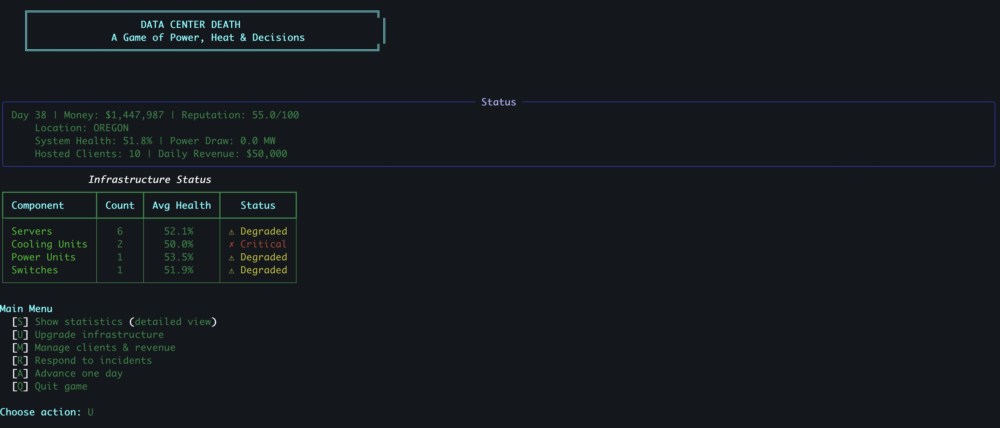
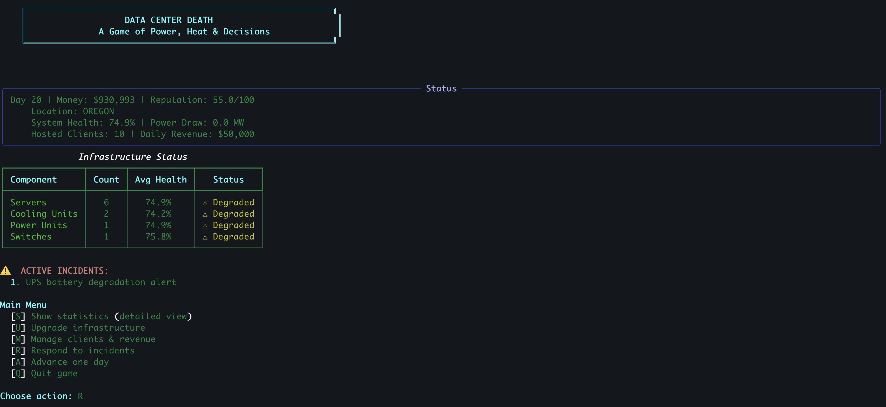
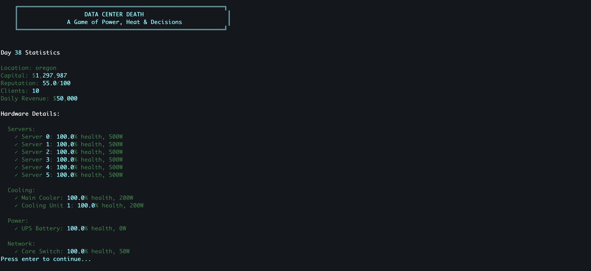
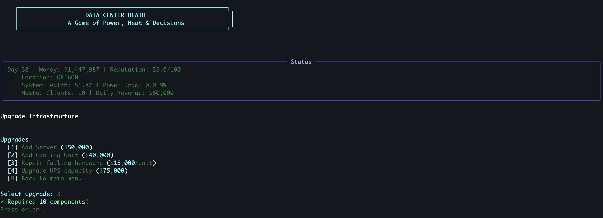

# Data Center Death

A terminal-based strategy/simulation game where you manage a real-world data center. Balance power consumption, cooling, hardware degradation, and client satisfaction while making critical decisions under pressure.









## Features

- **5 Real Data Center Locations** — Choose from Portland, Des Moines, Phoenix, Ashburn, or Reykjavik, each with unique characteristics
- **Dynamic Simulation** — Hardware degrades realistically, incidents occur randomly, operational costs accumulate
- **Resource Management** — Balance power draw, cooling capacity, and financial constraints
- **Strategic Decisions** — Choose between quick fixes and professional repairs, aggressive growth vs. stability
- **Multiple Win/Lose Conditions** — Bankruptcy, catastrophic system failure, or continuous operation

## Installation

```bash
cd data-center-death
python3 -m venv venv
source venv/bin/activate  # On Windows: venv\Scripts\activate
pip install -r requirements.txt
```

## How to Play

```bash
python3 main.py
```

### Game Mechanics

**Resources:**
- **Money** — Spend on upgrades, repairs, and client acquisition
- **Reputation** — Affects client retention and growth potential (0-100)
- **Infrastructure Health** — Average health of all systems (servers, cooling, power, network)

**Daily Operations:**
- Infrastructure automatically degrades
- Hardware failures trigger incidents randomly
- Revenue accrues based on hosted clients
- Operational costs deduct (power, cooling, maintenance, facility)

**Player Actions:**
1. **Upgrades** — Add servers, cooling units, repair failing hardware
2. **Client Management** — Acquire clients legitimately or poach competitors
3. **Incident Response** — Quick-fix (cheap/risky) or professional repair (expensive/reliable)
4. **Monitoring** — Check detailed statistics and status

### Game Over Conditions

- **Bankruptcy** — Money drops to $0 or below
- **Catastrophic Failure** — System health drops below 10%
- **Victory** — Reach day 100 with reputation > 50 and positive cash flow

## Data Center Characteristics

| Location | Power (MW) | Cooling | Cost/Month | Climate | Best For |
|----------|-----------|---------|------------|---------|----------|
| Portland, OR | 50 | 300 | $150k | Cold | Efficiency |
| Des Moines, IA | 45 | 250 | $120k | Temperate | Budget |
| Phoenix, AZ | 55 | 400 | $140k | Hot | High capacity |
| Ashburn, VA | 60 | 320 | $180k | Temperate | Performance |
| Reykjavik, Iceland | 40 | 200 | $160k | Cold | Green energy |

## Game Tips

1. **Start Conservative** — Build reputation before aggressively scaling
2. **Monitor Hardware** — Preventive repairs are cheaper than emergency fixes
3. **Balance Growth** — Adding clients without infrastructure causes failures
4. **Climate Matters** — Cold datacenters have lower cooling costs
5. **Diversify Risks** — Don't rely too heavily on cheap, unreliable hardware

## Project Structure

```
data-center-death/
├── main.py              # Game loop and main logic
├── game_state.py        # Game state, hardware, and data centers
├── ui.py                # Terminal UI and menus
├── requirements.txt     # Python dependencies
└── README.md            # This file
```

## Future Enhancements

- [ ] Save/load game state
- [ ] Multiple difficulty levels
- [ ] Leaderboards
- [ ] Advanced incident types (power surges, cyber attacks)
- [ ] Dynamic pricing and market competition
- [ ] Network visualization and monitoring
- [ ] Environmental impact tracking
- [ ] Achievements/challenges

## License

MIT

---

**Made with ❤️ using Python, Rich, and caffeine**
